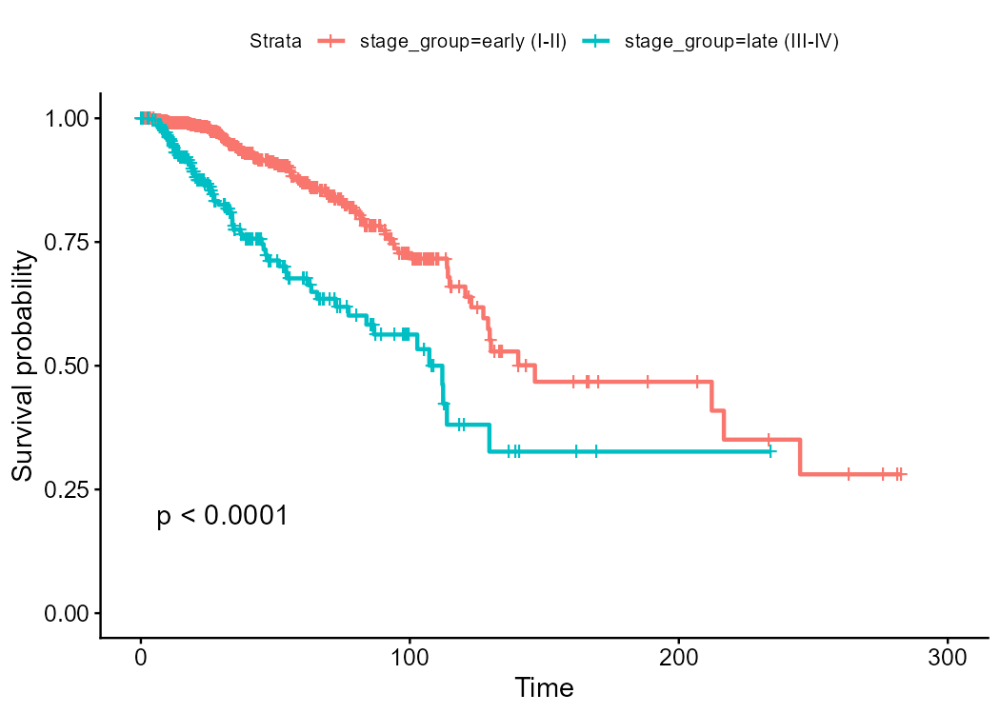
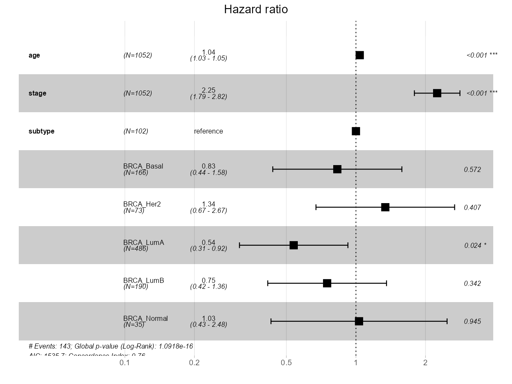

# Cancer Survival Prediction — TCGA-BRCA

Survival analysis of **real breast-cancer patients** (TCGA-BRCA, Pan-Cancer Atlas 2018): Kaplan–Meier curves,
the log-rank test, a multivariable **Cox proportional-hazards** model, and risk stratification — in **R
(`survival`)** and **Python (`lifelines`)** on the same cohort, with matching results.



## Research question

Which clinical/molecular factors predict overall survival in breast cancer, and can we combine them into a risk
score that separates patients — the core task of clinical prognostication and precision oncology?

## Biological / statistical background

**Time-to-event (survival)** data pairs a follow-up **time** with an **event/censoring** flag (many patients are
**censored** — still alive at last contact — which ordinary regression can't handle). The **survival function
S(t)** is the probability of surviving beyond t; the **hazard** is the instantaneous event rate. **Kaplan–Meier**
estimates S(t) non-parametrically; the **log-rank test** compares groups. The **Cox model** —
`h(t) = h0(t)·exp(Σβx)` — gives each covariate a **hazard ratio** (HR = exp β; >1 worse, <1 protective) without
assuming a baseline-hazard shape, under the **proportional-hazards** assumption (checked with Schoenfeld
residuals). The **C-index** (0.5 = random, 1 = perfect) measures how well the risk score ranks patients.

## Data

**TCGA-BRCA**, Pan-Cancer Atlas 2018 — real patients, clinical table fetched from the **cBioPortal** datahub.
Outcome: overall survival (`OS_MONTHS` + `OS_STATUS`). Covariates: age, AJCC tumour **stage** (I–IV), PAM50
molecular **subtype**. Both the R and Python scripts download the identical file from the same URL.

## Methods & pipeline

Fetch + clean → `Surv(time, event)` → **Kaplan–Meier + log-rank** by stage group → **multivariable Cox** (HRs,
95% CI, p) → **Schoenfeld** PH-assumption check → **C-index** → risk score (Cox linear predictor) → median split
→ risk-group KM.

| Stage | R (`survival`/`survminer`) | Python (`lifelines`) |
|---|---|---|
| KM + log-rank | `survfit`, `survdiff` | `KaplanMeierFitter`, `logrank_test` |
| Cox model | `coxph` | `CoxPHFitter` |
| PH check | `cox.zph` | `check_assumptions` |
| Discrimination | `summary()$concordance` | `concordance_index_` |

## Key result

Late-stage (III–IV) patients have markedly worse survival (significant log-rank); tumour **stage** is the
dominant hazard ratio, with age and molecular subtype adding prognostic information; **C-index ≈ 0.65–0.75**;
the Cox-derived risk groups separate cleanly on the KM plot.



## Interpretation

Tumour stage is the leading prognostic factor, modulated by molecular subtype and age — exactly the logic behind
clinical staging and precision-oncology treatment decisions. The model both **discriminates** (C-index) and
yields interpretable **hazard ratios**. R and Python agree on the same real cohort.

## Limitations

Observational (association, not causal treatment effect); proportional hazards may not hold for every covariate
(inspect `cox.zph`); a single retrospective cohort; C-index measures ranking, not calibrated risk; patients with
missing clinical fields are dropped. Rigorous next steps: add molecular features (expression/mutations),
penalised Cox / random survival forests, and **external validation on an independent cohort** (e.g. METABRIC).

## Files

```
cancer_survival.R        # R pipeline (survival + survminer)
cancer_survival.ipynb    # Python pipeline (lifelines)
results_R/               # km_stage.png, cox_forest.png, km_riskgroups.png, cox_hr.csv
results_py/              # km_stage.png, km_riskgroups.png, cox_hr.csv
```

## Run

**R:** open `cancer_survival.R`, set working dir to file location, source it (installs survival/survminer/broom;
fetches the TCGA-BRCA clinical file). **Python:** `pip install lifelines`, run `cancer_survival.ipynb`.
